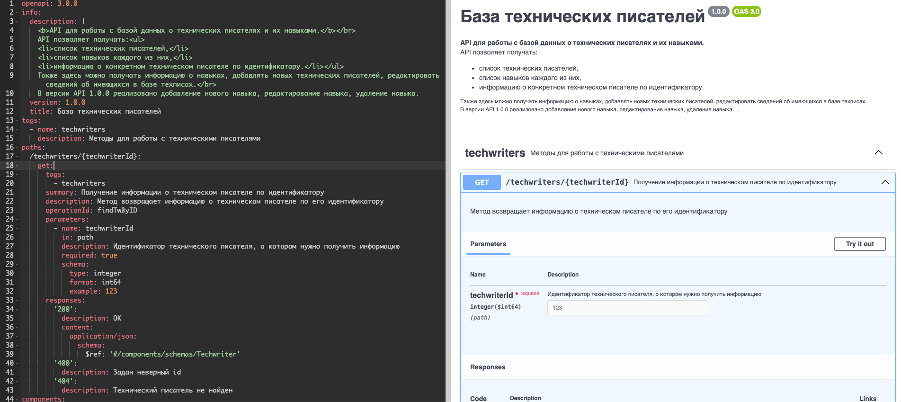

# Урок 2. Описание методов API в формате OpenAPI

На этом уроке рассмотрим, как описываются методы (конечные точки) API в формате OpenAPI. Т.е. после занятия у нас уже будет документация, которую можно показывать разработчикам.

## Про OpenAPI

Для описания API будем использовать спецификацию `OpenAPI v3.0.0`. Почему не более `v3.1.0` свежую от 2021 года? `v3.0.0` хоть и была опубликована в 2017 году, ее и сейчас «по инерции» используют многие. К тому же и некоторые привычные всем инструменты (например, `Swagger Editor`) «ругаются» на v3.1.0.
В одном из следующих уроков обязательно рассмотрим разницу между этими версиями спецификации.

Описывать API  можно в формате `YAML` или `JSON`: как вам удобно. В курсе будем использовать `YAML`.

## Инструменты для работы со спецификацией

Писать спецификацию на API в формате `OpenAPI v3.0.0` можно с помощью разных инструментов. Выбирайте удобный:

- [https://editor.swagger.io/](https://editor.swagger.io/) — онлайн-редактор из состава экосистемы инструментов «Swagger».
- [https://app.swaggerhub.com/](https://app.swaggerhub.com/) — тоже онлайн-редактор. Нужна регистрация. На бесплатном аккаунте можно создавать и публиковать до трех описаний API.
- Плагин [OpenAPI (Swagger) Editor](https://marketplace.visualstudio.com/items?itemName=42Crunch.vscode-openapi) для `VS Code` — редактор со Swagger UI прямо в IDE.

## Описание методов API в формате OpenAPI

Спецификация в формате `OpenAPI` — это один большой объект (он же — схема), который состоит из полей и объектов поменьше (они, в свою очередь тоже состоят из объектов).
Состав «корневого» объекта описан в спецификации (https://spec.openapis.org/oas/v3.0.0#fixed-fields). Видно, что часть объектов здесь обязательная, а часть — нет.

Мы в курсе будем использовать следующие из них:

- `оpenapi` — обязательное поле. Здесь указывается, версия  спецификации OpenAPI, в которой описывается API.
- `info` — обязательный объект. Здесь указывается информация непосредственно о нашем API (описание, версия и т.д.)
- `tags` — необязательный объект. Используется для группировки  методов API. Это нужно, например, для того, чтобы разработчики и пользователи API могли лучше ориентироваться в документации.
- `paths` — обязательный объект. Здесь описываются конечные точки (методы) API.
- `components` — необязательный объект. Здесь описываются повторно используемые компоненты, которые могут быть использованы в различных частях документации.

Давайте рассмотрим создание описания API в формате OpenAPI на примере метода для получения информации об одном техническом писателе.

Ресурс `«Технический писатель»` мы [спроектировали](lesson1#Проектирование-ресурса-«Технический-писатель») на первом уроке. Теперь давайте опишем в формате `OpenAPI` его и метод для получения одного техписа (одного ресурса).

Фрагмент спецификации на наш API, в которой описан метод для получения информации об одном техническом писателе (его можно скачать по [ссылке](https://gitlab.com/denmaloyreb/apidocs_course/-/blob/main/OAS-specs/oas-3.0.0_iteration_1.yaml?ref_type=heads)):

```yaml
openapi: 3.0.0
info:
  description: |
    <b>API для работы с базой данных о технических писателях и их навыками.</b></br>
    API позволяет получать:<ul>
    <li>список технических писателей,</li>
    <li>список навыков каждого из них,</li>
    <li>информацию о конкретном техническом писателе по идентификатору.</li></ul>
    Также здесь можно получать информацию о навыках, добавлять новых технических писателей, редактировать сведений об имеющихся в базе техписах.</br>
    В версии API 1.0.0 реализовано добавление нового навыка, редактирование навыка, удаление навыка.
  version: 1.0.0
  title: База технических писателей
tags:
  - name: techwriters
    description: Методы для работы с техническими писателями
paths:
  /techwriters/{techwriterId}:
    get:
      tags:
        - techwriters
      summary: Получение информации о техническом писателе по идентификатору
      description: Метод возвращает информацию о техническом писателе по его идентификатору
      operationId: findТwByID
      parameters:
        - name: techwriterId
          in: path
          description: Идентификатор технического писателя, о котором нужно получить информацию
          required: true
          schema:
            type: integer
            format: int64
            example: 123
      responses:
        '200':
          description: ОК
          content:
            application/json:
              schema:
                $ref: '#/components/schemas/Techwriter'
        '400':
          description: Задан неверный id
        '404':
          description: Технический писатель не найден
components:
  schemas:
    Techwriter:
      type: object
      properties:
        id:
          type: integer
          format: int64
          description: Идентификатор технического писателя
          example: 123
        name:
          type: string
          description: Имя технического писателя
          example: Вася
        secondName:
          type: string
          description: Фамилия технического писателя
          example: Пупкин
        patronymic:
          type: string
          description: Отчество технического писателя. Необязательное поле
          example: Иванович
        experience:
          type: integer
          format: int64
          description: Опыт работы (в месяцах)
          example: 12
        phoneNumber:
          type: string
          format: phone
          description: Номер телефона для связи
          example: +71234567890
        email:
          type: string
          format: email
          description: Адрес электронной почты технического писателя
          example: pupkin@mail.pup
        skills:
          type: array
          description: Список навыков (массив идентификаторов навыков)
          items:
            type: integer
            format: int64
            example: 1
          example: [1, 2, 3]
      required:
        - id
        - name
        - secondName
        - experience
        - skills
        - email
```

Вы можете скопировать ее в любой из указанных выше инструментов и посмотреть, как это все рендерится.

Пример отрисовки метода в [https://editor.swagger.io/](https://editor.swagger.io/)



**Кратко поясняю, что здесь происходит:**

- **Строка 1**. В объекте `оpenapi` указано, что документация на API подготовлена в формате `OpenAPI v3.0.0`.
- **Строки со 2 по 12**. В объекте `info` указана основная информация про API: краткой и развернутое описание и версия. Здесь можно использовать, например, html-теги, чтобы в Swagger UI или на статическом сайте это выглядело красиво и удобочитаемо.
- **Строки с 13 по 15**. В объекте `tags указан` тег (пока один, другие добавим в следующих уроках) для группировки методов в документации.
- **Строка 16**. Отсюда начинается описание методов (конечных точек).
- **Строки с 17 по 43**. Здесь описан метод для получения информации об одном техническом писателе `/techwriters/{techwriterId}`.
- **Строка 44**. Отсюда начинается описание объекта `components`.
- **Строки с 46 по 94** — здесь описан ресурс (объект) `Techwriter`, который возвращается в ответе метода для получения информации об одном техническом писателе `/techwriters/{techwriterId}` (на этот ресурс есть ссылка из описания метода в строке 39).

Теперь у нас уже есть какая-то документация (один из видов документации) на API для работы с базой технических писателей. И ее можно показывать разработчикам.

## Что дальше

В следующих уроках:

- [опишем остальные методы](lesson3) для реализации действий, указанных в ТЗ в [Уроке 1](lesson1).
- научимся [собирать](lesson4) и [кастомизировать](lesson5) статический сайт-справочник.
