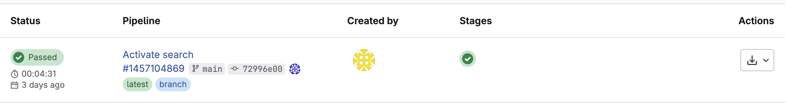
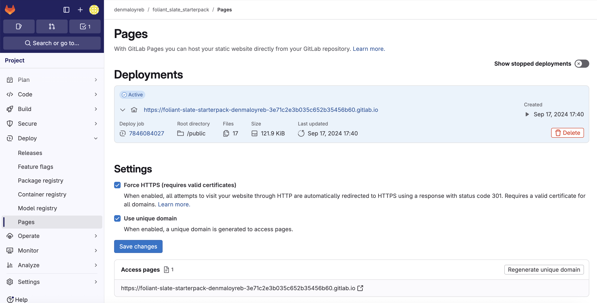

# Урок 4.  Сборка и публикация статического сайта-справочника API

Сегодня мы соберем статический сайт-справочник API из ранее созданной спецификации с помощью [Foliant](https://foliant-docs.github.io/docs/) (используя бэкенд [Slate](https://foliant-docs.github.io/docs/backends/slate/)).

## Предусловия для локальной сборки сайта-справочника

Чтобы собрать сайт локально, у вас на компьютере должны быть:

- `Git`, чтобы работать с репозиторием со [стартерпаком](https://gitlab.com/denmaloyreb/foliant_slate_starterpack) для сборки справочника API.
- `Docker`, чтобы можно было собрать сайт-справочник и запустить его локально.

## Локальная сборка сайта-справочника

Если (когда) `Git` и `Docker` установлены:

- Форкните [репозиторий со стартерпаком](https://gitlab.com/denmaloyreb/foliant_slate_starterpack) для сборки справочника API с Foliant. Для этого у вас должен быть аккаунт на `GitLab` (процесс создания аккаунта и форка репозитория опустим — с этим предлагаю разобраться самостоятельно).
Когда будете форкать репозиторий, `GitLab` предложит придумать для него имя (можно оставить как есть). Я свой форк назвал `api_docs_foliant_slate_starterpack`.
- Склонируйте форкнутый репозиторий себе на локальный компьютер.
- Откройте репозиторий в любом IDE. И сделайте следующие изменения:
    1. Добавьте в корень репозитория файл с расширением `.yaml`. Имя ему можно дать любое. Я назвал этот файл `techwriters.yaml`.
    2. Скопируйте в созданный на предыдущем шаге файл содержимое итоговой спецификации API ([ссылка на файл](https://gitlab.com/denmaloyreb/apidocs_course/-/blob/main/OAS-specs/oas-3.00_iteration_3.yaml)). *Не забудьте сохранить изменения*.
    3. Найдите в корне репозитория файл `foliant.yml`. В нем, в строке `8`, замените `pet_swagger.json` на имя файла, который был добавлен в папку на предудщих шагах (в моем случае это `techwriters.yaml`). *Не забудьте сохранить изменения*.
- Соберите сайт. Для этого запустите терминал (консоль) в папке склонированного репозитория и выполните команду:
    
    ```shell
    docker-compose run --rm foliant make site --with slate
    ```

**Готово**. В случае успешного выполнения команды вы увидите в терминале (консоли) сообщение вроде:

```shell
...

Project built successfully.

Done
────────────────────
Result: API.slate/
```

А в папке склонированного репозитория появится папка `API.slate` — это и есть наш статический сайт справочник.
Теперь, чтобы посмотреть результат сборки, перейдите в папку `API.slate` и откройте файл `index.html`.

**Поздравляю. Вы собрали сайт с дефолтными настройками**.

## Публикация сайта-справочника GitLab pages

В репозитории со стартерпаком есть все настройки для деплоя сайта-справочника на `GitLab pages`. Чтобы опубликовать сайт, сделайте коммит с изменениями, внесенными ранее, и запушьте изменения в ветку `main` (конечно, пушить сразу в main не есть хорошо, но мы же работаем с репозиторием сами и учимся).
Если все хорошо, в разделе `Build -> Pipelines` вашего репозитория на `GitLab` появится успешный пайплан (подсвечивается зеленым цветом):



А в разделе `Deploy -> Pages` — ссылка на собранный сайт (см. скрины в комментариях к посту). Мой сайт, например, опубликовался по адресу [https://api-docs-foliant-slate-starterpack-1c1fb4.gitlab.io](https://api-docs-foliant-slate-starterpack-1c1fb4.gitlab.io/#-).



## Что дальше  

В [следующем уроке](lesson5) будут рассмотрены некоторые моменты, связанные с кастомизацией сайта.
