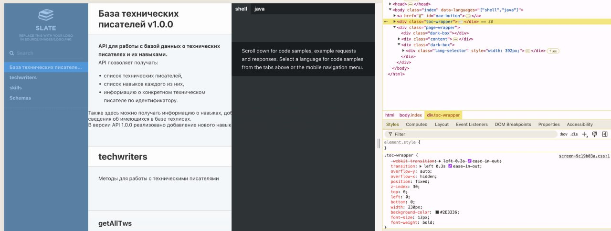
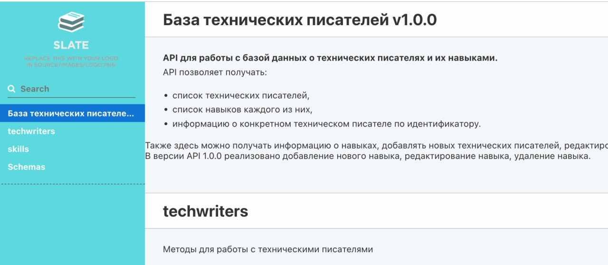

# Урок 5. Кастомизация сайта

В [Уроке 4](lesson4) мы собрали сайт-справочник и настроили его деплой на `GitLab pages`.
Но он с дефолтными настройками. А ведь, наверняка вам захочется его кастомизировать (поменять цвета, размеры элементов, убрать какую-то информацию, добавить JS-скрипты и пр.).

## Возможности по кастомизации сайта

Все это реально: в репозитории со стартерпаком, который мы использовали на прошлом уроке, есть все необходимое для кастомизации сайта:

- Папка `slate_shards/basic` — здесь хранится шаблон страницы сайта-справочника, JS-скрипты, CSS-файлы и картинки, которые использует бэкенд `Slate` из состава `Foliant` для сборки сайта. Т.е. отсюда можно управлять всем, скажем так «фронтендом», нашего справочника.
- Папка `widdershins_templates` — здесь хранятся шаблоны, в соответствии с которыми происходит преобразование OpenAPI-спецификации в `Markdown`, который потом отдается бэкенду `Slate` для генерации сайта.

Досконально разбираться что за что отвевает в этих папках не будем, при желании можете сделать это самостоятельно. Со `slate_shards/basic` все понятно: открываем собранный сайт, открываем инструменты разработчика в браузере и изучаем селекторы элементов страницы, после чего можно влиять на них посредствам содержимого папки:

С шаблонами `widdershins_templates` поможет разобраться официальная документация [Widdershins](https://github.com/Mermade/widdershins).

## Пример кастомизации сайта

Давайте для примера внесем небольшие изменения в наш сайт, чуть-чуть кастомизировав его: изменим цвет подложки левой части сайта (где расположен список методов и ссылки на них).

Через инструменты разработчика можно увидеть (см. рисунок выше), что левая часть сайта имеет CSS-класс `toc-wrapper`, а цвет подложки для нее — `#2E3336` (черный). Давайте заменим его, например, на цвет с HEX-кодом `#5cd8df`.
Для этого в файле `slate_shards/basic/source/stylesheets/screen.css.scss` найдите класс `.toc-wrapper`, Видно, что для него цвет подложки задан через переменную `background-color: $nav-bg;`. Можно изменить цвет, заменив `$nav-bg` на `#5cd8df` или же, заменив значение переменной `$nav-bg` в файле `slate_shards/basic/source/stylesheets/_variables.scss`. Если выбрать первый вариант, цвет изменится только для класса `.toc-wrapper`. Если же изменить значение переменной, тогда цвет изменится для всех классов и элементов, в CSS-правилах которых он используется.
Я изменил значение переменной и цвет применился для подложки левой части сайта, а также для поля ввода формы поиска по сайту (т.к. он задается через ту же переменную $nav-bg в файле `slate_shards/basic/source/stylesheets/screen.css.scss`).

> После внесения изменений не забудьте пересобрать сайт, чтобы увидеть результат.

Теперь вы знаете, как кастомизировать сайт-справочник API, собранный с помощью `Foliant` и `Slate`. Напоминаю, что только цветами возможности кастомизации не ограничиваются: при должной сноровке вы сможете придать сайту какой угодно вид и даже добавить интерактивности. Рекомендую потренироваться.

## Что дальше

В [следующем уроке](lesson6) разберемся, как документировать API с помощью `Foliant` и `Slate`, если спецификации OpenAPI у вас (на проекте) нет. Придется создавать описания методов вручную.
